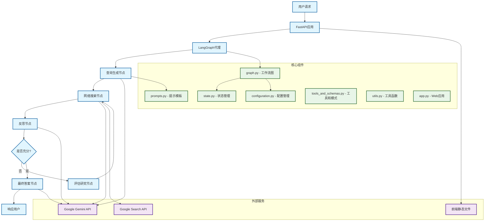

# Backend 架构文档

## 1. 技术栈

### 核心框架
- **LangGraph 0.4.8**: 用于构建多步骤AI代理的图形化工作流框架
- **FastAPI 0.115.12**: 现代化、高性能的Python Web框架，用于构建API
- **LangChain 0.3.25**: LLM应用开发框架，提供模型抽象和工具集成
- **Google Gemini**: 主要的大语言模型提供商

### AI/ML 相关
- **langchain-google-genai 2.1.5**: Google Gemini模型的LangChain集成
- **google-genai 1.18.0**: Google Generative AI的官方Python客户端
- **langsmith 0.3.44**: LangChain的监控和调试平台

### 数据处理与验证
- **Pydantic 2.11.5**: 数据验证和序列化
- **SQLAlchemy 2.0.41**: SQL工具包和对象关系映射(ORM)
- **python-dotenv 1.1.0**: 环境变量管理

### 服务器与部署
- **uvicorn 0.34.3**: ASGI服务器实现
- **starlette 0.46.2**: 轻量级ASGI框架
- **sse-starlette 2.1.3**: 服务端事件推送支持

### 辅助工具
- **tenacity 9.1.2**: 重试机制
- **structlog 25.4.0**: 结构化日志
- **watchfiles 1.0.5**: 文件监控（开发模式）

## 2. 架构关系



## 3. 技术要点

### 3.1 LangGraph 工作流设计
- **状态驱动**: 使用 TypedDict 定义多层次状态管理
- **并行执行**: 支持多个搜索查询的并行处理
- **条件路由**: 基于反思结果决定工作流走向
- **迭代改进**: 通过反思机制实现知识gap的迭代填补

### 3.2 多模型策略
```python
# 不同任务使用不同的Gemini模型
query_generator_model: "gemini-2.0-flash"        # 查询生成
reflection_model: "gemini-2.5-flash-preview-04-17"  # 反思分析
answer_model: "gemini-2.5-pro-preview-05-06"    # 答案合成
```

### 3.3 引用与溯源系统
- **URL缩短**: 将长URL映射为短链接以节省token
- **引用标记**: 自动在文本中插入引用标记
- **元数据追踪**: 保留搜索结果的grounding metadata

### 3.4 配置驱动架构
- **环境变量**: 通过.env文件管理敏感配置
- **运行时配置**: 支持通过RunnableConfig动态调整参数
- **默认值**: 为所有配置项提供合理的默认值

### 3.5 前端集成策略
- **单一应用**: FastAPI同时服务API和静态文件
- **路径分离**: API路由与前端路由互不冲突
- **开发友好**: 支持热重载和开发模式

## 4. 实现能力列表

### 4.1 核心研究能力
- ✅ **智能查询生成**: 基于用户问题自动生成多样化搜索查询
- ✅ **并行网络搜索**: 同时执行多个搜索任务提高效率
- ✅ **知识gap识别**: 自动分析搜索结果识别信息缺口
- ✅ **迭代信息收集**: 基于gap分析生成follow-up查询
- ✅ **智能答案合成**: 将多源信息合成为连贯的答案

### 4.2 搜索与信息处理
- ✅ **Google搜索集成**: 使用原生Google Search API
- ✅ **实时信息获取**: 确保获取最新的网络信息
- ✅ **多源信息整合**: 从多个网页提取和整合信息
- ✅ **引用自动生成**: 为所有信息来源提供准确引用
- ✅ **URL解析优化**: 智能处理和缩短引用链接

### 4.3 工作流控制
- ✅ **可配置循环次数**: 控制最大研究迭代次数
- ✅ **智能停止条件**: 基于信息充分性自动停止
- ✅ **错误处理与重试**: 网络请求的容错机制
- ✅ **状态持久化**: 维护整个会话的状态信息
- ✅ **并发控制**: 合理管理并行任务的执行

### 4.4 API与服务能力
- ✅ **RESTful API**: 标准的HTTP API接口
- ✅ **流式响应**: 支持Server-Sent Events
- ✅ **前端集成**: 无缝集成React前端
- ✅ **静态文件服务**: 生产环境的静态资源托管
- ✅ **CORS支持**: 跨域请求处理

### 4.5 开发与部署
- ✅ **容器化部署**: Docker支持
- ✅ **环境配置**: 灵活的环境变量管理
- ✅ **开发模式**: 热重载和调试支持
- ✅ **日志记录**: 结构化日志输出
- ✅ **监控集成**: LangSmith追踪支持

## 5. 全接口 API 列表

### 5.1 LangGraph 标准 API

基于 LangGraph 框架，系统自动提供以下标准API端点：

#### 5.1.1 助手管理
```http
GET /assistants
```
- **功能**: 获取所有可用的助手列表
- **响应**: 助手配置信息数组

```http
GET /assistants/{assistant_id}
```
- **功能**: 获取特定助手的详细信息
- **参数**: `assistant_id` - 助手唯一标识符
- **响应**: 助手详细配置

#### 5.1.2 线程管理
```http
POST /threads
```
- **功能**: 创建新的对话线程
- **请求体**: 
```json
{
  "metadata": {},
  "if_exists": "raise"
}
```
- **响应**: 线程ID和元数据

```http
GET /threads/{thread_id}
```
- **功能**: 获取线程信息
- **参数**: `thread_id` - 线程唯一标识符

```http
PUT /threads/{thread_id}
```
- **功能**: 更新线程元数据
- **请求体**: 更新的元数据

```http
DELETE /threads/{thread_id}
```
- **功能**: 删除指定线程

#### 5.1.3 运行管理
```http
POST /threads/{thread_id}/runs
```
- **功能**: 在指定线程中创建新的运行
- **参数**: `thread_id` - 线程ID
- **请求体**:
```json
{
  "assistant_id": "agent",
  "input": {
    "messages": [
      {
        "role": "human",
        "content": "用户查询内容"
      }
    ]
  },
  "config": {
    "configurable": {
      "number_of_initial_queries": 3,
      "max_research_loops": 2
    }
  },
  "stream_mode": ["values", "updates"],
  "metadata": {}
}
```
- **响应**: 运行ID和初始状态

```http
GET /threads/{thread_id}/runs/{run_id}
```
- **功能**: 获取运行状态和结果
- **参数**: 
  - `thread_id` - 线程ID
  - `run_id` - 运行ID

```http
GET /threads/{thread_id}/runs
```
- **功能**: 获取线程的所有运行记录
- **查询参数**:
  - `limit` - 限制返回数量
  - `offset` - 分页偏移量

#### 5.1.4 流式接口
```http
POST /threads/{thread_id}/runs/stream
```
- **功能**: 创建流式运行，实时获取代理执行过程
- **参数**: 与 POST `/threads/{thread_id}/runs` 相同
- **响应**: Server-Sent Events 流
- **事件类型**:
  - `data`: 节点执行结果
  - `metadata`: 执行元数据
  - `error`: 错误信息

```http
GET /threads/{thread_id}/runs/{run_id}/stream
```
- **功能**: 获取已存在运行的流式输出
- **响应**: SSE流，包含执行过程的实时更新

#### 5.1.5 状态管理
```http
GET /threads/{thread_id}/state
```
- **功能**: 获取线程当前状态
- **响应**: 完整的状态对象

```http
POST /threads/{thread_id}/state
```
- **功能**: 更新线程状态
- **请求体**: 状态更新对象

#### 5.1.6 中断点控制
```http
PUT /threads/{thread_id}/runs/{run_id}/resume
```
- **功能**: 恢复暂停的运行
- **请求体**:
```json
{
  "config": {},
  "input": null
}
```

```http
POST /threads/{thread_id}/runs/{run_id}/cancel
```
- **功能**: 取消正在运行的任务

### 5.2 前端静态资源 API

#### 5.2.1 前端应用
```http
GET /app/{path:path}
```
- **功能**: 服务React前端应用
- **参数**: `path` - 前端路由路径
- **响应**: HTML文件或静态资源

#### 5.2.2 静态资源
```http
GET /app/assets/{file_path}
```
- **功能**: 服务前端静态资源 (CSS, JS, 图片等)
- **参数**: `file_path` - 资源文件路径
- **响应**: 静态文件内容

### 5.3 系统管理 API

#### 5.3.1 健康检查
```http
GET /health
```
- **功能**: 系统健康状态检查
- **响应**: 
```json
{
  "status": "healthy",
  "timestamp": "2025-06-03T16:00:00Z"
}
```

#### 5.3.2 API文档
```http
GET /docs
```
- **功能**: Swagger API文档界面
- **响应**: HTML文档页面

```http
GET /redoc
```
- **功能**: ReDoc API文档界面
- **响应**: HTML文档页面

```http
GET /openapi.json
```
- **功能**: OpenAPI规范JSON
- **响应**: OpenAPI 3.0规范文件

### 5.4 配置参数说明

#### 5.4.1 代理配置参数
```json
{
  "configurable": {
    "query_generator_model": "gemini-2.0-flash",
    "reflection_model": "gemini-2.5-flash-preview-04-17", 
    "answer_model": "gemini-2.5-pro-preview-05-06",
    "number_of_initial_queries": 3,
    "max_research_loops": 2
  }
}
```

#### 5.4.2 流模式配置
- `values`: 返回节点的完整输出值
- `updates`: 返回状态更新差异
- `debug`: 包含调试信息
- `messages`: 仅返回消息更新

### 5.5 响应格式示例

#### 5.5.1 成功响应
```json
{
  "run_id": "01234567-89ab-cdef-0123-456789abcdef",
  "thread_id": "thread_01234567",
  "status": "success",
  "output": {
    "messages": [
      {
        "role": "assistant",
        "content": "基于我的研究，这里是您问题的详细答案...",
        "metadata": {
          "sources_gathered": [
            {
              "label": "示例网站",
              "short_url": "https://vertexaisearch.cloud.google.com/id/0-1", 
              "value": "https://example.com/article"
            }
          ]
        }
      }
    ]
  },
  "created_at": "2025-06-03T16:00:00.000Z",
  "updated_at": "2025-06-03T16:00:30.000Z"
}
```

#### 5.5.2 流式响应事件
```
event: data
data: {"type": "node", "node": "generate_query", "data": {"query_list": ["搜索查询1", "搜索查询2"]}}

event: data  
data: {"type": "node", "node": "web_research", "data": {"web_research_result": ["搜索结果内容..."]}}

event: data
data: {"type": "node", "node": "finalize_answer", "data": {"messages": [{"role": "assistant", "content": "最终答案..."}]}}
```

### 5.6 错误响应

#### 5.6.1 通用错误格式
```json
{
  "error": {
    "type": "ValidationError",
    "message": "输入验证失败", 
    "details": {
      "field": "messages",
      "issue": "不能为空"
    }
  },
  "status_code": 422
}
```

#### 5.6.2 常见错误码
- `400`: 请求格式错误
- `401`: 认证失败  
- `404`: 资源不存在
- `422`: 输入验证失败
- `500`: 服务器内部错误
- `503`: 服务不可用

---

## 总结

该后端架构基于 LangGraph 构建了一个强大的AI研究代理系统，具有完整的API接口、智能的工作流控制和强大的信息处理能力。系统采用模块化设计，易于扩展和维护，同时提供了丰富的配置选项和监控能力。
