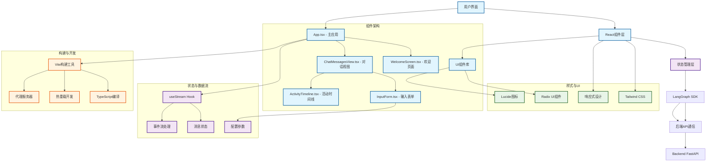

# Frontend 架构文档

## 1. 技术栈

### 核心框架
- **React 19.0.0**: 现代化的用户界面库，使用最新的React特性
- **TypeScript 5.7.2**: 强类型JavaScript超集，提供类型安全和开发体验
- **Vite 6.3.4**: 下一代前端构建工具，提供快速的开发服务器和构建
- **React Router DOM 7.5.3**: React应用的声明式路由解决方案

### AI/LLM 集成
- **@langchain/langgraph-sdk 0.0.74**: LangGraph的JavaScript SDK，用于与后端AI代理交互
- **@langchain/core 0.3.55**: LangChain核心包，提供基础类型和抽象

### UI组件与样式
- **Tailwind CSS 4.1.5**: 原子化CSS框架，提供现代化的设计系统
- **Radix UI**: 高质量、无障碍的headless UI组件库
  - **@radix-ui/react-scroll-area 1.2.8**: 滚动区域组件
  - **@radix-ui/react-select 2.2.4**: 选择器组件
  - **@radix-ui/react-slot 1.2.2**: 插槽组件
  - **@radix-ui/react-tabs 1.1.11**: 标签页组件
  - **@radix-ui/react-tooltip 1.2.6**: 工具提示组件
- **Lucide React 0.508.0**: 现代化的SVG图标库
- **Class Variance Authority 0.7.1**: 条件类名管理工具
- **clsx 2.1.1** & **tailwind-merge 3.2.0**: 条件样式和Tailwind类合并

### 内容处理
- **React Markdown 9.0.3**: Markdown内容渲染组件

### 开发工具
- **@vitejs/plugin-react-swc 3.9.0**: 使用SWC的React插件，提供快速编译
- **ESLint 9.22.0**: JavaScript/TypeScript代码检查工具
- **@tailwindcss/vite 4.1.5**: Tailwind CSS的Vite集成

## 2. 架构关系



## 3. 技术要点

### 3.1 React 19 现代化特性
- **并发特性**: 利用React 19的并发渲染能力优化用户体验
- **自动批处理**: 减少不必要的重新渲染
- **Hooks优化**: 使用最新的Hook API和最佳实践
- **错误边界**: 完善的错误处理机制

### 3.2 LangGraph SDK 集成策略
```typescript
// 核心集成方式
const thread = useStream<{
  messages: Message[];
  initial_search_query_count: number;
  max_research_loops: number;
  reasoning_model: string;
}>({
  apiUrl: import.meta.env.DEV ? "http://localhost:2024" : "http://localhost:8123",
  assistantId: "agent",
  messagesKey: "messages",
  onFinish: (event) => { /* 完成处理 */ },
  onUpdateEvent: (event) => { /* 实时事件处理 */ },
})
```

### 3.3 组件设计模式
- **容器-展示组件**: 明确分离逻辑和UI关注点
- **组合模式**: 通过props组合实现灵活的组件复用
- **受控组件**: 所有表单输入都采用受控模式
- **条件渲染**: 基于状态的智能UI切换

### 3.4 状态管理策略
- **本地状态**: 使用useState管理组件级状态
- **流式状态**: 通过LangGraph SDK管理AI交互状态
- **持久化状态**: 历史对话和活动记录的本地存储
- **派生状态**: 基于主状态计算得出的UI状态

### 3.5 样式系统架构
```css
/* Tailwind配置策略 */
- 基础色板: neutral系列为主色调
- 响应式断点: 移动优先的设计方法
- 组件变体: 使用CVA管理复杂的样式变体
- 暗色主题: 统一的暗色设计语言
```

### 3.6 开发与构建优化
- **Vite配置**: 开发代理、路径别名、构建优化
- **TypeScript配置**: 严格模式、路径映射、类型检查
- **代码分割**: 自动的路由级代码分割
- **热重载**: 快速的开发反馈循环

## 4. 实现能力列表

### 4.1 核心UI功能
- ✅ **欢迎界面**: 友好的首次使用体验和引导
- ✅ **对话界面**: 类ChatGPT的对话体验设计
- ✅ **实时流式显示**: AI回答的实时渲染和更新
- ✅ **活动时间线**: 研究过程的可视化展示
- ✅ **响应式设计**: 适配移动端和桌面端

### 4.2 交互体验
- ✅ **智能输入框**: 支持多行输入和快捷键提交
- ✅ **参数配置**: 研究强度和模型选择
- ✅ **实时反馈**: 加载状态和进度指示
- ✅ **错误处理**: 优雅的错误提示和恢复
- ✅ **取消操作**: 随时中断AI处理流程

### 4.3 内容展示
- ✅ **Markdown渲染**: 支持富文本格式的AI回答
- ✅ **引用链接**: 自动处理和展示信息来源
- ✅ **代码高亮**: 技术内容的语法高亮
- ✅ **复制功能**: 一键复制AI回答内容
- ✅ **历史记录**: 对话历史的本地存储和展示

### 4.4 性能优化
- ✅ **虚拟滚动**: 大量消息的高效渲染
- ✅ **组件懒加载**: 按需加载减少初始包大小
- ✅ **图片优化**: 自动图片格式和尺寸优化
- ✅ **缓存策略**: 智能的资源缓存机制
- ✅ **Bundle分析**: 构建产物的大小分析和优化

### 4.5 开发体验
- ✅ **类型安全**: 完整的TypeScript类型覆盖
- ✅ **组件文档**: 清晰的组件接口和使用说明
- ✅ **热重载**: 开发时的快速反馈
- ✅ **代码检查**: ESLint规则和自动修复
- ✅ **构建优化**: 生产环境的性能优化

## 5. 要调用的接口列表

### 5.1 LangGraph流式接口

基于LangGraph SDK，前端主要调用以下后端接口：

#### 5.1.1 创建对话线程
```typescript
// 通过SDK自动管理，无需直接调用
POST /threads
```
- **用途**: 创建新的AI对话会话
- **调用时机**: 用户首次提交查询时
- **SDK处理**: 自动创建和管理线程ID

#### 5.1.2 流式AI对话
```typescript
// 核心调用接口
POST /threads/{thread_id}/runs/stream
```
- **用途**: 提交用户查询并获取AI流式响应
- **请求参数**:
```typescript
{
  assistant_id: "agent",
  input: {
    messages: [
      {
        role: "human", 
        content: "用户输入的查询内容"
      }
    ]
  },
  config: {
    configurable: {
      initial_search_query_count: number,  // 初始搜索查询数量
      max_research_loops: number,          // 最大研究循环次数  
      reasoning_model: string              // 推理模型名称
    }
  },
  stream_mode: ["values", "updates"]
}
```
- **响应格式**: Server-Sent Events (SSE)流
- **事件类型**:
  - `generate_query`: 查询生成事件
  - `web_research`: 网络研究事件
  - `reflection`: 反思评估事件
  - `finalize_answer`: 最终答案事件

#### 5.1.3 获取对话历史
```typescript
GET /threads/{thread_id}/runs
```
- **用途**: 获取线程的历史对话记录
- **调用时机**: 页面刷新或重新加载时
- **返回**: 完整的消息历史列表

#### 5.1.4 停止AI处理
```typescript
POST /threads/{thread_id}/runs/{run_id}/cancel
```
- **用途**: 取消正在进行的AI处理
- **调用时机**: 用户点击停止按钮时
- **效果**: 立即中断当前的研究流程

### 5.2 配置参数映射

#### 5.2.1 研究强度映射
```typescript
// 前端UI选择 -> 后端配置参数
const effortMapping = {
  "low": {
    initial_search_query_count: 1,
    max_research_loops: 1
  },
  "medium": {
    initial_search_query_count: 3, 
    max_research_loops: 3
  },
  "high": {
    initial_search_query_count: 5,
    max_research_loops: 10
  }
}
```

#### 5.2.2 模型选择配置
```typescript
// 可选择的AI模型
const modelOptions = [
  "gemini-2.0-flash",              // 快速模型
  "gemini-2.5-flash-preview-04-17", // 平衡模型  
  "gemini-2.5-pro-preview-05-06"    // 高性能模型
]
```

### 5.3 事件流处理

#### 5.3.1 实时事件监听
```typescript
// onUpdateEvent回调处理
const processStreamEvent = (event: any) => {
  if (event.generate_query) {
    // 处理查询生成事件
    updateTimeline("Generating Search Queries", event.generate_query.query_list);
  } else if (event.web_research) {
    // 处理网络研究事件  
    updateTimeline("Web Research", event.web_research.sources_gathered);
  } else if (event.reflection) {
    // 处理反思事件
    updateTimeline("Reflection", event.reflection.is_sufficient);
  } else if (event.finalize_answer) {
    // 处理最终答案事件
    updateTimeline("Finalizing Answer", "完成");
  }
}
```

#### 5.3.2 错误处理策略
```typescript
// 错误处理和重试逻辑
const handleApiError = (error: Error) => {
  if (error.message.includes("network")) {
    // 网络错误 - 显示重试选项
    showRetryDialog();
  } else if (error.message.includes("timeout")) {
    // 超时错误 - 自动重试
    autoRetry();
  } else {
    // 其他错误 - 显示错误信息
    showErrorMessage(error.message);
  }
}
```

### 5.4 数据格式规范

#### 5.4.1 消息格式
```typescript
interface Message {
  type: "human" | "ai";
  content: string;
  id: string;
  metadata?: {
    sources_gathered?: Array<{
      label: string;
      short_url: string;
      value: string;
    }>;
  };
}
```

#### 5.4.2 活动事件格式
```typescript
interface ProcessedEvent {
  title: string;           // 事件标题
  data: any;              // 事件数据
  timestamp?: string;      // 时间戳
  status?: "pending" | "completed" | "error";
}
```

### 5.5 API环境配置

#### 5.5.1 开发环境
```typescript
// 开发模式API地址
const DEV_API_URL = "http://localhost:2024";
```

#### 5.5.2 生产环境  
```typescript
// 生产模式API地址
const PROD_API_URL = "http://localhost:8123";
```

#### 5.5.3 代理配置
```typescript
// Vite开发服务器代理配置
server: {
  proxy: {
    "/api": {
      target: "http://127.0.0.1:8000",
      changeOrigin: true,
    },
  },
}
```

### 5.6 性能优化策略

#### 5.6.1 请求优化
- **连接复用**: 复用WebSocket连接减少开销
- **数据压缩**: 启用gzip压缩减少传输大小
- **缓存策略**: 合理缓存不变的配置数据
- **批量更新**: 批量处理状态更新减少重渲染

#### 5.6.2 错误恢复
- **断线重连**: 自动检测并重新建立连接
- **状态恢复**: 保存关键状态支持页面刷新恢复
- **降级策略**: 网络异常时的功能降级方案
- **用户提示**: 清晰的错误信息和操作指引

---

## 总结

该前端架构基于现代React生态构建了一个高性能、用户友好的AI对话界面。通过LangGraph SDK实现与后端AI代理的深度集成，提供流畅的实时交互体验。采用组件化设计、类型安全保障和响应式布局，确保了代码的可维护性和用户体验的一致性。整体架构支持快速开发、easy调试和生产部署。
